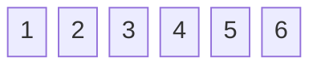

---
# You can also start simply with 'default'
theme: apple-basic
# some information about your slides (markdown enabled)
titleTemplate: '%s'
title: Data Structures and You
info: 'Data Structures, Algorithms and Advanced Programming'
# https://sli.dev/features/drawing
drawings:
  persist: false
# slide transition: https://sli.dev/guide/animations.html#slide-transitions
transition: slide-left
# enable MDC Syntax: https://sli.dev/features/mdc
mdc: true
#
author: Chris Janes
selectable: false

layout: intro-image
image: 'https://images.unsplash.com/photo-1456428746267-a1756408f782?q=80&w=3540&auto=format&fit=crop&ixlib=rb-4.0.3&ixid=M3wxMjA3fDB8MHxwaG90by1wYWdlfHx8fGVufDB8fHx8fA%3D%3D'
hideInToc: true
---
<div class="absolute bottom-10">
<h1>Data Structures and You</h1>
</div>

<div class="w-full absolute top-10">
  <div class="font-700">
    Chris Janes 23/02/25
  </div>
  <div>
    Data Structures, Algorithms and Advanced Programming
  </div>
</div>

---
hideInToc: true
transition: slide-left
---

# Today's topics
<toc />


---
transition: slide-left
layout: two-cols-header
---
# What are Data Structures anyway?

Data structures are a way for us to represent data in our applications.

:: left ::

<v-clicks depth="2">

- Two types:
    - Primitive
    - Non-Primitive

</v-clicks>

:: right ::

<v-click>

The primitive types in C++ are:

</v-click>

<<< @/snippets/primitives.cpp cpp {hide|1|2|3|4|5|all}


<!-- Simply put, they’re a way for us to represent data in our applications – we look at them as two types; primitive and non-primitive (or advanced). Primitive types are usually those provided by the language itself; for example, in C++ we have bool, int, float, char, etc. -->
---
layout: quote
hideInToc: true
---

# "Bad programmers worry about the code. Good programmers worry about data structures and their relationships."
-- Linus Torvalds

---
layout: bullets
---

# Advanced Data Structures

These come in a few different forms which influence how they work and how they are used.

<div class="">
  <div class="flex justify-around items-stretch mt-6 object-bottom">
  <ul>
    <li v-click="1">Linear</li>
    <li v-click="2">Static</li>
    <li v-click="3">Homogeneous</li>
  </ul>

  <h2 v-click="1">vs.</h2>

  <ul>
    <li v-click="1">Non-linear</li>
    <li v-click="2">Dynamic</li>
    <li v-click="3">Heterogeneous</li>
  </ul>
  </div>
</div>

<!-- Non-primitive structures are also called advanced data structures or abstract data types and that is the nomenclature we'll use from here on out. These are constructed from primitive types and other data structures. 

[click] Linear structures arrange store their elements in consecutive memory locations. 
[click] Static structures are fixed in size and cannot be resized. 
[click] Homogenous structures can only hold elements of the same type 

-->
---
layout: default
---

# Arrays
<v-click>

## Static, Linear, Homogenous
</v-click>

<v-click>

A simple data structure that stores elements in <span v-mark.highlight.red="2">contiguous</span> memory:


<div class="flex justify-center">

</div>
</v-click>

<v-click>

````md magic-move
```cpp
type name[size];
```
```cpp
int numbers[6] = {1, 2, 3, 4, 5, 6};
```
```cpp
int numbers[] = {1, 2, 3, 4, 5, 6};
```
```cpp
int numbers[10] = {1, 2, 3, 4, 5, 6}; // elements 6 to 9 are 0
```
```cpp
std::array<int, 6> numbers = {1, 2, 3, 4, 5, 6};
```
```cpp
int* numbers = new int[6];
```
```cpp
int* numbers = new int[6];
delete[] numbers;
```
````
</v-click>

```cpp {hide|1|2}
int first = numbers[0];
numbers[5] = -5;
```

```cpp {hide|all}
int first = numbers[-1];
numbers[6] = -5;
```

<!-- Arrays are probably the most basic form of data structure we will look at. 

[click] They are linear, static and homogeneous - 
[click] storing memory in contiguous memory.

[click] When we instantiate an array in C++, the compiler allocates the space necessary as one block, based on the size of the specified type and the fixed size of the array.

[click] So to create an array of integers, we do this - here we're also providing a set of values to fill the array with

[click] when we specify elements at compile-time, we do not need to specify a size.

[click] If we do specify a size and offer up fewer elements, the remaining elements will be set to zero (or the default value for the type).

[click] we can also use the std::array template class, which is a bit more modern and offers some additional functionality.

[click] If we really, really need an array allocated at runtime, then we need to dynamically allocate it using the new[] operator [click] and then remember to delete that array once we're done with it.

[click] Arrays are zero-indexed, so to get the first element we use index 0 [click] to get the last, array size - 1.

[click] If we try and access an array with a value below 0 or above the array size - 1, we are out of bounds which can cause all sorts of issues, the best of which is a straight crash. -->

---
layout: default
---
# Multidimensional Arrays
Arrays all the way down.

<v-click>
````md magic-move
```cpp
type name[size][size][size]
```

```cpp
int matrix[3][2]
```
````
</v-click>

<v-click>
````md magic-move
<<< @/snippets/multi_arrays.cpp cpp

<<< @/snippets/multi_array_loop.cpp cpp
````
</v-click>

<v-click>
````md magic-move
```cpp
std::cout << matrix[0][1] << '\n' // prints 3 (0 * 3 + 1 * 2 + 1)
```

```cpp
matrix[0][3] = 1;
std::cout << matrix[1][1] // prints 1!
```
````
</v-click>

<v-click at="7">

$$ {hide|1|2-3}
\begin{aligned}
  Address[i][j] = Base Address(BA) +\omega(n(i-1)+(j-1)) \\
   Address[0][3] = \omega(3(0-1)+(3-1)) \\
   Address[1][1] = \omega(3(1-1)+(1-1))
  \end{aligned}
$$

</v-click>

<!-- Arrays can store arrays, which themselves can store arrays - though much beyond 2 or 3 dimensional arrays are rarely used in "day to day" coding. 

[click] We can instantiate a dimensional array by specifying a further set of array sizes in square brackets. 

[click] Each dimension does not need to be the same size allowing us to have "ragged" arrays.

[click] As with 1d arrays, we can initialize them on construction 
[click] or via a loop later in the code base.

[click] accessing elements is the same as single dimensional arrays - they are referenced in row-major order.

[click] accessing out of bounds in a multidimensional array can have unexpected consequences - here, [0][3] modifies the element at [1][1]...
[click] This happens because of how the array is stored in memory and how the indices represent an offset from the start of the memory allocation.
We can calculate the memory location for any given combination of indices using this formula, where Base Address is the specific memory location for the start of the array, w is the size of the stored type in bytes and n is the number of rows in the array.

[click] 
-->

---
layout: image-left
image: https://images.unsplash.com/photo-1579684385127-1ef15d508118?q=60&w=1000&auto=format&fit=crop
---
# Array Operations
The most common operations are:

- Traversal
- Insertion
- Deletion
- Searching
- Sorting

---

## Traversal
The process of visiting each element of an array

<v-click>
````md magic-move
```cpp
std::string words[] = {"hello", "world", "example", "string"};
```
```cpp
std::string words[] = {"hello", "world", "example", "string"};

for (int i = 0; i < 4; ++i)
{

}
```
```cpp
std::string words[] = {"hello", "world", "example", "string"};

for (int i = 0; i < 4; ++i) 
{
  std::cout << words[i] << '\n';
}
```
```cpp
std::string words[] = {"hello", "world", "example", "string"};

for (int i = 0; i < 4; ++i) 
{
  if (!words[i].empty()) {
       
  }
}
```
```cpp
std::string words[] = {"hello", "world", "example", "string"};

for (int i = 0; i < 4; ++i) 
{
  if (!words[i].empty()) {
    words[i][0] = std::toupper(words[i][0]);      
  }
}
```
```cpp
std::string words[] = {"hello", "world", "example", "string"};

for (int i = 0; i < 4; ++i) 
{
  if (!words[i].empty()) {
    words[i][0] = std::toupper(words[i][0]);      
  }
}

for (int i = 4; i >= 0; i--) 
{
  if (!words[i].empty()) { 
    words[i][0] = std::toupper(words[i][0]);      
  }
}
```
````
</v-click>


<!-- In most programming languages, this is achieved by iterating over the array, one element at a time - either from front to back or vice versa. 

There are quite a few reasons we might want to do this; performing a calculation on each element, filtering out elements that meet a certain criteria, or just printing them out. If the array holds
advanced data structures or objects, we might want to call a method on each element.

[click] Here we have an array of strings, and we want to capitalize the first letter of each word.

[click] We can do this by iterating over the array 

[click] and then accessing each element in turn.

[click] We can then check if the element is empty 

[click] if not, we can capitalize the first letter.

[click] By starting at the end of the array, we can also traverse it in reverse.
-->

---

## Insertion
<div class="container">

<div v-if="$slidev.nav.clicks > 0 && $slidev.nav.clicks < 8">

## At the beginning

</div>

<div v-else-if="$slidev.nav.clicks > 1 && $slidev.nav.clicks < 9">

## At a specific point

</div>

<div v-else-if="$slidev.nav.clicks > 8">

## At the end

</div>


<div class="columns-2">
<v-click at="2">

<div class="w-full break-after-column"> 
````md magic-move {at:2}
```text {none|1,9|2-3|4|5-7|8|all}
START
IF N = SIZE
  END
SET I = N
REPEAT WHILE I>=0
  SET ARR[I+1] = ARR[I]
  I = I-1
SET ARR[0] = NEW_ITEM
END
```
```text
START
IF N = SIZE
  END
SET I = N
REPEAT WHILE I>=POS
  SET ARR[I+1] = ARR[I]
  I = I-1
SET ARR[POS] = NEW_ITEM
END
```
```text
START
IF N = SIZE
  END
SET ARR[N] = NEW_ITEM
END
```
````
</div>

<div>

````md magic-move{at:2}
```cpp {none|1,2,3,14|4|6|7-10|12|all}
bool InsertIntoArray(int* numbersArray, int arrMax, 
  int arrSize, int valToInsert)
{
	if (arrSize >= arrMax) return false;

	int i = arrSize;
	while (i >= 0) {
		numbersArray[i + 1] = numbersArray[i];
		i--;
	}

	numbersArray[0] = valToInsert;
	return true;
}
```
```cpp
bool InsertIntoArrayAtPosition(int* numbersArray, int arrMax, 
	int arrSize, int valToInsert, int position)
{
	if (arrSize >= arrMax) return false;

	int i = arrSize;
	while (i >= position) {
		numbersArray[i + 1] = numbersArray[i];
		i--;
	}

	numbersArray[position] = valToInsert;

	return true;
}
```
```cpp
bool InsertIntoArrayAtEnd(int* numbersArray, int arrMax, 
	int arrSize, int valToInsert)
{
	if (arrSize >= arrMax) return false;
	numbersArray[arrSize] = valToInsert;

	return true;
}
```
````
</div>
</v-click>

</div>
</div>

<!-- Due to the fixed size nature of arrays, inserting an element without overwriting existing data requires some work. 
There are three places we can insert; at the beginning, at a specific point and at the end. 

[click] For insertion at the beginning, we have to move all existing elements along one slot in the array - [click] the algorithm for which looks something like this. A quick comment on the C++ slide of things here; when we use an array as an argument in a function - it's not passed-by-value, instead the array decays to a pointer to the memory location at the start of the array...

[click] we cannot insert anything if the array is full - N is the number of existing elements and SIZE is the max size of the array.

[click] we start at the end of the array - so we set I to the value of N

[click] then we iterate while I is greater to or equal to 0, each iteration we set copy the current element to the position one "behind" where we are and I is decremented

[click] once I is equal to 0, we're at the start of the array and can insert the new element at the first index 

[click] Let's just see that all lit up...

[click] inserting at a specific position is the same, we move the elements back until we reach the desired position and then we set the element to the new value. 

[click] while inserting at the end is very straightforward, we just set the element to the new value. -->


---

## Deletion
<div class="container">

<div v-if="$slidev.nav.clicks < 5">

## At the beginning

</div>

<div v-else-if="$slidev.nav.clicks < 6">

## At a specific point

</div>

<div v-else>

## At the end

</div>


<div class="columns-2">
<v-click>

<div class="w-full break-after-column"> 
````md magic-move {at:2}
```text {1,6|2|3-5|all}
START
SET I = 0
WHILE I < N-1
  SET ARR[I] = ARR[I+1]
  I = I+1
END
```
```text
START
SET I = POS
WHILE I < N-1
  SET ARR[I] = ARR[I+1]
  I = I+1
END
```
```text
START
SET N = N-1
END
```
````
</div>

<div>

````md magic-move{at:2}
```cpp {1-3,12|4|5-9|all}
int DeleteFromArrayAtBeginning(int* numbersArray, 
  int arrMax, int arrSize)
{
	int i = 0;
	while (i < arrSize)
	{
		numbersArray[i] = numbersArray[i + 1];
		i++;
	}

	return --arrSize;
}
```
```cpp
int DeleteFromArrayAtPosition(int* numbersArray, 
  int arrMax, int arrSize, int position)
{
	int i = position;
	while (i < arrSize)
	{
		numbersArray[i] = numbersArray[i + 1];
		i++;
	}

	return --arrSize;
}
```
```cpp
int DeleteFromArrayAtEnd(int arrSize)
{
	return --arrSize;
}
```
````
</div>
</v-click>

</div>
</div>


<!-- Deletion is similar, with algorithms for deleting an element at the start, at a specified position and at the end.

[click] The steps for deleting at the beginning are:

[click] set the index to 0

[click] while the index is less than the number of elements - 1, copy the element at the next index to the current index [click] 

[click] deleting at a specific position is similar, rather than starting at 0 we start at position.

[click] deleting at the end is a bit simpler, we just decrement the number of elements in the array.
 -->

---

## Searching
Linear search iterates over an array from start to finish

<v-click>

````md magic-move
```cpp {all}
int SearchArrayLinearly(int valToFind, int arr[], int arrSiz)
{
  
}
```
```cpp {3-6}
int SearchArrayLinearly(int valToFind, int arr[], int arrSize)
{
  for (int i = 0; i < arrSize; i++)
  {

  }
}
```
```cpp{5,6,9|all}
int SearchArrayLinearly(int valToFind, int arr[], int arrSize)
{
  for (int i = 0; i < arrSize; i++)
  {
    if(arr[i] == valToFind)
      return i;
  }

  return -1;
}
```
````

</v-click>


<!-- There are a couple of ways of searching an array, but we'll just look at the linear approach
for now (the other is a binary search, which requires a sorted array and is more complex)  

[click] It's fairly straight forward to sequentially search an array:
The function takes the value to find, the array and the array size.

[click] A for loop is used to iterate from 0 to the size of the array

[click] At each iteration, we compare the value in the array against the desired value, if we find it
we return the index we found it at.

Otherwise, we return -1
-->
---
layout: statement
---
## Sorting

<!--
Sorting is it's own entire thing, so we'll call a break here and come back to that shortly!
-->
---