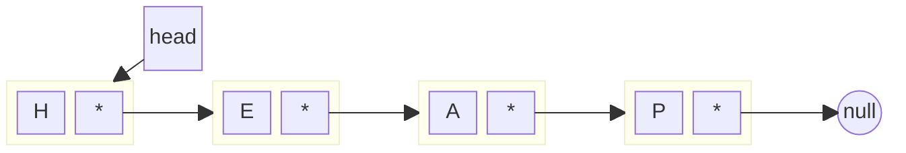
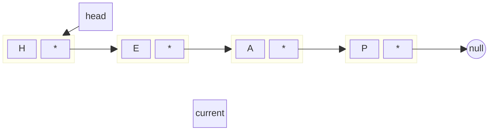
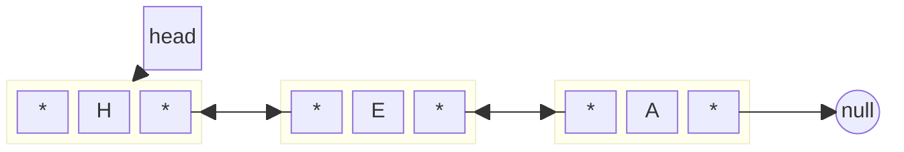

<div class="absolute bottom-10">
<h1 class="">Linked Lists</h1>
</div>

<div class="w-full absolute top-10">
  <div class="font-700">
    Chris Janes 30/01/25
  </div>
  <div>
    Data Structures, Algorithms and Advanced Programming
  </div>
</div>

---
hideInToc: true
---

# In this session

<toc />

---

# Linked Lists

<v-click>

## Dynamic, Linear, Homogenous
</v-click>

<v-click>

A data structure that stores elements <span v-mark.highlight.red="2">across</span> memory:

<style>
div.mermaid {
  text-align: center;
}
</style>

<div class="flex">
<div class="flex-auto">


</div>

</div>

</v-click>


<!-- [click] Linked-lists are dynamic data structures that store elements in linear form but potentially scattered across memory, rather than contiguously.

[click] In contrast to an array, a linked list allocates space for each element separately in it’s own block of memory called a node or linked list element. The list gets its structure by using pointers to connect all its nodes together in a chain. This means that we can add elements to a linked list for as long as we have spare memory capacity, unlike an array that has a fixed size.

Each node contains a payload or data element, and a reference or pointer to the next node in the list. If the pointer is null, then the node is the last node in the list. Because of this, you cannot access elements "randomly" as you can in an array (as the index is just an offset into the contiguous memory space) - you must traverse the list from beginning to end to find the element you are looking for - this means there is a higher time complexity for accessing elements compared to an array.

There is a standard library list implementation in C++, but as a learning exercise, we'll build our own implementation today - though for "day to day" use, I'd definitely recommend sticking with the STL version of nearly all data structures!
-->

---
layout: quote
---

# "Linked lists are immoral."
## Matthew Wilcox

<!-- Linked Lists often get something of a bad rap; they're sometimes viewed as something only useful in an academic context, in part because of the cost of traversing them compared to an array. 

We'll get into the why's of that shortly.
-->

---

# Linked List Operations

<v-clicks>

- Traversal
- Insert Beginning
- Insert After
- Insert End
- Remove Beginning
- Remove After
- Remove End
- Search
- Length

</v-clicks>

---

# Traversal

Visiting each node in turn, from 'head' to 'tail'

<v-click>

````md magic-move
```text
START
  SET CURRENT = HEAD
END
```
```text
START
  SET CURRENT = HEAD
  REPEAT WHILE CURRENT IS NOT NULL
    
  END WHILE
END
```
```text
START
  SET CURRENT = HEAD
  REPEAT WHILE CURRENT IS NOT NULL
    SET CURRENT = CURRENT.NEXT
  END WHILE
END
```
```text
START
  SET CURRENT = HEAD
  REPEAT WHILE CURRENT IS NOT NULL
    PRINT CURRENT
    SET CURRENT = CURRENT.NEXT
  END WHILE
END
```
````

</v-click>

<v-click at="5">

<style>
div.mermaid {
  text-align: center;
}
</style>

<div class="flex mt-10">
<div class="flex-auto">

<v-click>



</v-click>

</div>

</div>

</v-click>

<!-- As with arrays, traversal is fairly straight forward we just need to keep moving through the list until we get to a node where the "next" point is null. 

[click] So we start by setting current to point to the first element, the "head" of the list.
[click] Then we loop while that pointer is not null
[click] in each iteration, we set current to equal the next pointer in the list
[click] while we're doing this, we could print the value of each element.
-->

---
layout: three-column-header
---

# Insertion

:: left ::

<v-click>

## At the beginning

````md magic-move
```text
START [VALUE]
  ALLOCATE NEW_NODE
END
```
```text
START [VALUE]
  ALLOCATE NEW_NODE
  SET NEW_NODE.DATA = VALUE
  SET NEW_NODE.NEXT = HEAD
END
```
```text
START [VALUE]
  ALLOCATE NEW_NODE
  SET NEW_NODE.DATA = VALUE
  SET NEW_NODE.NEXT = HEAD
  SET HEAD = NEW_NODE
END
```
````

</v-click>

:: middle ::

<v-click>

## After a specific point

````md magic-move
```text
START [VALUE, TARGET]
  ALLOCATE NEW_NODE
  SET NEW_NODE.DATA = VALUE
END
```
```text
START [VALUE, TARGET]
  ALLOCATE NEW_NODE
  SET NEW_NODE.DATA = VALUE
  SET CURRENT = HEAD
END
```
```text
START [VALUE, TARGET]
  ALLOCATE NEW_NODE
  SET NEW_NODE.DATA = VALUE
  SET CURRENT = HEAD
  REPEAT WHILE I < TARGET
    SET CURRENT = CURRENT.NEXT
    SET I = I + 1
  END
END
```
```text
START [VALUE, TARGET]
  ALLOCATE NEW_NODE
  SET NEW_NODE.DATA = VALUE
  SET CURRENT = HEAD
  REPEAT WHILE I < TARGET
    SET CURRENT = CURRENT.NEXT
    SET I = I + 1
  END
  SET NEW_NODE.NEXT = CURRENT.NEXT
END
```
```text
START [VALUE, TARGET]
  ALLOCATE NEW_NODE
  SET NEW_NODE.DATA = VALUE
  SET CURRENT = HEAD
  REPEAT WHILE I < TARGET
    SET CURRENT = CURRENT.NEXT
    SET I = I + 1
  END
  SET NEW_NODE.NEXT = CURRENT.NEXT
  SET CURRENT.NEXT = NEW_NODE
END
```
````

</v-click>

:: right ::

<v-click>

## At the end

````md magic-move
```text
START [VALUE]
  ALLOCATE NEW_NODE
  SET NEW_NODE.DATA = VALUE
END
```
```text
START [VALUE]
  ALLOCATE NEW_NODE
  SET NEW_NODE.DATA = VALUE
  SET CURRENT = HEAD
END
```
```text
START [VALUE]
  ALLOCATE NEW_NODE
  SET NEW_NODE.DATA = VALUE
  SET CURRENT = HEAD
  WHILE CURRENT.NEXT IS NOT NULL
    SET CURRENT = CURRENT.NEXT
  END
END
```
```text
START [VALUE]
  ALLOCATE NEW_NODE
  SET NEW_NODE.DATA = VALUE
  SET CURRENT = HEAD
  WHILE CURRENT.NEXT IS NOT NULL
    SET CURRENT = CURRENT.NEXT
  END
  SET CURRENT.NEXT = NEW_NODE
END
```
````

</v-click>

<!-- Again, in a similar form to arrays, we have insertion at a few different distinct points. 

[click] Inserting at the beginning is quite straightforward, we allocate space for the new node (in fact, all of these require this step first)

[click] We set the data element to the value we're inserting and make the next pointer point to the current location that head points to.

[click] Then we just set head to point to the location of the new node. 

[click] Inserting at a specific point starts in the same way, we allocate the new node and set its data property.

[click] Then we create a new pointer that is set to the current location pointed to by head

[click] Before we enter a loop that continues until we've reached the numbered element we want to insert the new node after.

[click] We set the next pointer on the new node to the current nodes next value 

[click] and finally set the current nodes next to point to the new node. 

[click] Inserting at the end is also fairly clear (and you should hopefully know what it entails by now) 

[click] We grab the head pointer and store its value in current

[click] Then we iterate over the list until we hit a node that has a null next pointer 

[click] And we set that to point to the new node instead. -->

---
layout: three-column-header
---

# Removal 

:: left ::

<v-click>

## At the beginning

````md magic-move
```text
START
  
END
```
```text
START
  SET OLD = HEAD
END
```
```text
START
  SET OLD = HEAD
  SET HEAD = OLD.NEXT
END
```
```text
START
  SET OLD = HEAD
  SET HEAD = OLD.NEXT
  DELETE OLD
END
```
````

</v-click>

:: middle ::

<v-click>

## After a specific point

````md magic-move
```text
START [TARGET]
  SET CURRENT = HEAD
END
```
```text
START [TARGET]
  SET CURRENT = HEAD
  REPEAT WHILE I < TARGET
    SET PREV = CURRENT
    SET CURRENT = CURRENT.NEXT
    I++
  END
END
```
```text
START [TARGET]
  SET CURRENT = HEAD
  REPEAT WHILE I < TARGET
    SET PREV = CURRENT
    SET CURRENT = CURRENT.NEXT
    I++
  END
  SET PREV.NEXT = CURRENT.NEXT
END
```
```text
START [TARGET]
  SET CURRENT = HEAD
  REPEAT WHILE I < TARGET
    SET PREV = CURRENT
    SET CURRENT = CURRENT.NEXT
    I++
  END
  SET PREV.NEXT = CURRENT.NEXT
  DELETE CURRENT
END
```
````

</v-click>

:: right ::

<v-click>

## At the end

````md magic-move
```text
START
  SET CURRENT = HEAD
END7
```
```text
START
  SET CURRENT = HEAD
  WHILE CURRENT.NEXT IS NOT NULL
    SET PREV = CURRENT
    SET CURRENT = CURRENT.NEXT
  END
END
```
```text
START
  SET CURRENT = HEAD
  WHILE CURRENT.NEXT IS NOT NULL
    SET PREV = CURRENT
    SET CURRENT = CURRENT.NEXT
  END
  SET PREV.NEXT = NULL
END
```
```text
START
  SET CURRENT = HEAD
  WHILE CURRENT.NEXT IS NOT NULL
    SET PREV = CURRENT
    SET CURRENT = CURRENT.NEXT
  END
  SET PREV.NEXT = NULL
  DELETE CURRENT
END
```
````

</v-click>

<!-- Removal or deletion continues that pattern... 

[click] Deleting from the front is also easy.

[click] We copy the current head pointer

[click] Set the head pointer to point to the next element from "old" 

[click] and now we can delete old to free up the memory.

[click] Unsurprisingly perhaps, deleting after a specific point is similar to insertion. 

[click] We loop over the list until we've hit the target point (in real code, we should also be checking that we haven't gone past the end of the list!)
At each iteration, we update a previous pointer to point to the current node

[click] Once we've found it, we set the previous pointers next to the current pointers next

[click] and we can delete the current node. 

[click] Deleting at the end is again, straightforward

[click] We iterate the list until we get to the node with a null next pointer; as with deleting after a specific element, we store a pointer to the previous node too

[click] To delete the final element, we set the previous nodes next point to null

[click] and deallocate the memory for the current node. -->

---

# Searching
Iterate the list until we find the specified value, or not.

<v-click>

````md magic-move
```text
START [VALUE]
  SET CURRENT = HEAD
END
```
```text
START [VALUE]
  SET CURRENT = HEAD
  REPEAT WHILE CURRENT.DATA IS NOT VALUE
    
  END
END
```
```text
START [VALUE]
  SET CURRENT = HEAD
  REPEAT WHILE CURRENT.DATA IS NOT VALUE
    SET CURRENT = CURRENT.NEXT
  END
END
```
```text
START [VALUE]
  SET CURRENT = HEAD
  REPEAT WHILE CURRENT.DATA IS NOT VALUE
    SET CURRENT = CURRENT.NEXT
    IF CURRENT IS NULL
      RETURN NULL
    END
  END
END
```
```text
START [VALUE]
  SET CURRENT = HEAD
  REPEAT WHILE CURRENT.DATA IS NOT VALUE
    SET CURRENT = CURRENT.NEXT
    IF CURRENT IS NULL
      RETURN NULL
    END
  END
  RETURN CURRENT
END
```
````

</v-click>

<!-- We've seen a form of searching several times already, so we don't need to spend much time considering it. We iterate the list and compare the data value
of each node against a specified value. If we find it, we can either return the "position" count or a pointer to the node that holds the value 

[click] As per at this point, we need a temporary pointer that starts by pointing to head 

[click] We loop while the current node does not hold the value we're searching for

[click] The current pointer gets pointed to the next node 

[click] and if that is null then the value we're searching for does not exist, so we return null

[click] otherwise, current points to the node that holds the value and we can return the pointer. -->

---

# Doubly-Linked Lists

<v-click>

<style>
div.mermaid {
  text-align: center;
}
</style>

<div class="flex">
<div class="flex-auto">


</div>

</div>

</v-click>

<!-- What we've looked at so far is a singly-linked list, that is, one which we can iterate over in only one direction. A doubly-linked list adds a "previous" pointer to the node structure, allowing us to go backwards through the list. This also modifies the operations a little too.

We can now insert and remove before a node and when we do any insertion or deletion, we have to also account for the prev pointer. -->

---
layout: two-column-header
---

# A Linked List Implementation

<div class="columns-2">

<div>

```cpp{hide|1-3,17|4-7,17|9-12|14-16|*}
template <typename T>
class Node {
public:
  Node(T value) 
    : _payload{value}, _next{nullptr} {}
  Node(T value, Node<T>* next) 
    : _payload{value}, _next{next} {}

  void setData(T value) { _payload = value; }
  T getData() const { return _payload; }
  Node<T>* getNext() { return _next; }
  void setNext(Node<T>* next) { _next = next; }

private:
  T _payload;
  Node<T>* _next;
};
```
</div>
<div>

```cpp{hide|1-3,19|4|6|7-9|11-13|15|17-18|*}
template <typename T>
class LinkedList {
public:
  LinkedList() : _head{nullptr} {}

  Node<T>* searchForValue(T val);
  void InsertAtBeginning(T val);
  void InsertAfterElement(T val, int target);
  void InsertAtEnd(T val);

  void DeleteAtBeginning();
  void DeleteAfterElement(int target);
  void DeleteAtEnd();

  void Traverse();

private:
  Node<T>* _head;
}
```
</div>

</div>

---
layout: center
---

# Finish the implementation