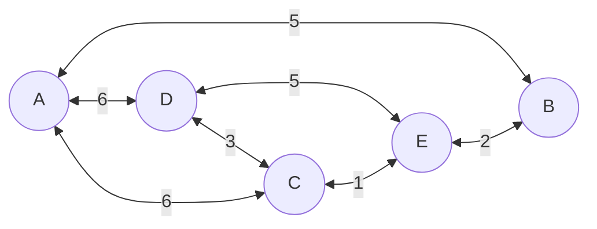

# Graph Worksheet <!-- omit from toc -->

<style>
.mermaid {
  text-align:center;
}
</style>



Before we begin, the code examples in this worksheet build on top of each other - so rather than reproduce entire sets of code that has already been discussed, you may see code snippets with a commented set of ellipses:

```cpp
// ...
```

These are used to mark where code already exists and is being left out for brevity - so as you follow this worksheet, if the code does not compile, just double check you haven't skipped a step and missed out something that was covered earlier and then hidden with the ellipses!

Building a graph data structure in C++ is not much different from building a Linked List or any other "node" style structure. If we don't already have one, we should create a `cpp` file that contains our `main` function - it not only lets us compile our code and test it, but it also gives us a good place to start debugging from.

### `main.cpp` <!-- omit from toc -->
```cpp
int main()
{

}
```

## Starting the Graph class

Now we can think about the code structure of the Graph; we need a way of representing the collection of Nodes, their connecting Edges and any potential weights we might need - ideally, we should be able to represent nearly any sort of graph with our implementation.

As a starting point, add a new header file to the project and "stub" out a `Graph` class definition:

### `graph.h` <!-- omit from toc -->
```cpp
#pragma once

class Graph {
public:
  Graph() {}
  ~Graph() {}

private:

};
```

Add an include statement to `main.cpp` to let us work with our Graph class in that file and while we're here, we might as well create an instance of the class too. Save both files and check it all compiles!

### `main.cpp` <!-- omit from toc -->
```cpp
#include "graph.h"

int main()
{
  Graph graph;
}
```

## Node Representation

Before we can add anything else to `Graph`, we have to think about how we are going to represent the nodes / vertices of a graph. There are several approaches to this, we could use an array to represent them as an [adjacency matrix](https://en.wikipedia.org/wiki/Adjacency_matrix) but as we're unlikely to be creating a particularly dense graph we are probably better off going for some form of [adjacency list](https://en.wikipedia.org/wiki/Adjacency_list).

So we could use something like an array or a [std::vector](https://en.cppreference.com/w/cpp/container/vector) that would store store a further list (in this case, another vector) of integer indices that represent the connections between nodes:

```cpp
std::vector<std::vector<int>> adjacency_list;
adjacency_list.push_back({}); // add node '0' to the list
adjacency_list.push_back({}); // add node '1' and so on
adjacency_list.push_back({});

adjacency_list[0].push_back(1); // add an edge between nodes 0 and 1
adjacency_list[0].push_back(2); // between nodes 0 and 2 ...
adjacency_list[1].push_back(0);
adjacency_list[1].push_back(2);
```

While this is quite straightforward conceptually, it makes things like adding data to each node slightly more complex as we would need a further construct that would map node indices to the data that node should contain. This is not the end of the world and it's definitely functional, but the approach we will take will lean into Object Oriented Programming a little more.

Add `node.h` as a new header file; this will contain the declaration of a `Node` class:

### `node.h` <!-- omit from toc -->

```cpp
#pragma once

class Node {

};
```

For an unweighted graph, we can quite easily represent the connections between nodes by having each node instance store pointers to other nodes that it is connected to:

### `node.h` <!-- omit from toc -->
```cpp
#include <vector>

class Node {

private:
  std::vector<Node*> _connections;
};
```

That's gives us a little more flexibility than the `vector` of `vector` of `int` we had before, but it does now allow us to represent the **cost** of a connection. A solution to this is to have a `Connection` object that stores both a pointer to a Node and a cost:


### `node.h` <!-- omit from toc -->
```cpp
struct Connection {
  Node* to;
  int cost;
};

class Node { // ...
```
Note: This leaves us in a slightly strange position, where Connection wants to use the `Node` class name before the `Node` class has been declared - which is due to the imperative / procedural nature of C++. We can resolve this by [forward declaring](https://en.wikipedia.org/wiki/Forward_declaration) the `Node` class prior to the declaration of `Connection`:

### `node.h` <!-- omit from toc -->
```cpp
class Node;

struct Connection {
  Node* to;
  int cost;
};
```
This works because C++ allows us to multiple declarations of the same object - it only has issue with multiple definitions. Notice how the forward declaration offers no details about `Node` other than the name - this saves us duplicating the Node declaration but it can also cause us errors. If we tried to call a method on the `to` pointer in `Connection` or access a property we would get an error about an [incomplete type](https://learn.microsoft.com/en-us/cpp/c-language/incomplete-types).

**Task:** With `Connection` declared, change the `_connection` vector to store `Connection` pointers instead of `Node` pointers.

## Adding Connections

Now we've got a way to represent a connection from one node to another along with the cost of that edge, we need a way to add connections between nodes.

The start of that is going to be in `Node`:

### `node.h` <!-- omit from toc -->
```cpp
class Node {
public:
  void addConnection(Node* to, int cost);

private:
// ...
};
```
We add the declaration of the member function `addFunction` to the `Node` class declaration - but now we need a definition. To keep our code "clean" and to minimise the risk of encountering a multiple definition error, we should put the definition in a separate translation unit (i.e. a new cpp file).

### `node.cpp` <!-- omit from toc -->
```cpp
#include "node.h"

void Node::addConnection(Node* to, int cost)
{

}
```
The easiest approach here is to just add the new connection without checking if there is already a connection that links this node with the `to` node:

### `node.cpp` <!-- omit from toc -->
```cpp
void Node::addConnection(Node* to, int cost)
{
  _connections.push_back(new Connection{to, cost});
}
```

As soon as we see the use of `new` we should be thinking about how that memory is cleared up - in this case, it makes sense to have a destructor for `Node` that will delete all the `Connection` instances that the node contains when the node is destroyed:

### `node.h` <!-- omit from toc -->
```cpp
class Node {
public:
  Node() {}
  ~Node() {
    for (auto connection : _connections)
    {
      delete connection;
    }
  }
  // ...
};


## Getting connections

Once we've got a way to add connections, we have to be able to get that list of connections back again - and so we need to add that to `Node`; it's fairly straightforward, we can have a function that will just return a copy of the _connections vector:

### `node.h` <!-- omit from toc -->
```cpp
class Node {
public:
  // ...
  std::vector<Connection*> getConnections() const;

private:
// ...
};
```

### `node.cpp` <!-- omit from toc -->
```cpp
std::vector<Connection*> Node::getConnections() const
{
  return _connections;
}
```

## Building a Graph

Now we have a way to add and retrieve connections to a node, we can add some further implementation to `Graph` so we can add nodes and specify connections between them. `Graph` needs to know about the Node objects that make it up, so it needs a way to track that information - because `Node` is relatively self-contained, we can just maintain a vector of pointers to `Node` instances:

### `graph.h` <!-- omit from toc -->
```cpp
#include <vector>
#include "node.h"

class Graph {
public:
  Graph() {}
  ~Graph() {
    for (auto node : _nodes)
    {
      delete node;
    }
  }

private:
  std::vector<Node*> _nodes;
};
```
We include the node header here so C++ understands the Node type in the vector declaration - we could forward declare Node again, as long as we then included the header in a suitable [translation unit](https://en.wikipedia.org/wiki/Translation_unit_(programming)) (i.e. `graph.cpp`), some [coding standards](https://dev.epicgames.com/documentation/en-us/unreal-engine/epic-cplusplus-coding-standard-for-unreal-engine#physicaldependencies) call for that approach wherever possible - but I tend to prefer the approach we are using where we only forward declare when we absolutely have to!

We have specified a destructor for `Graph` here too - that will delete all the `Node` instances that the graph contains when the graph is destroyed. This is a good practice to get into, as it ensures that we don't leak memory when we are done with the graph.

Now we need a way to add a node to the graph - as Node is so simple, that is straightforward:

### `graph.h` <!-- omit from toc -->
```cpp
class Graph {
public:
  // ...

  int addNode();
private:
  // ...
};
```
We now need to define `addNode`, so add a new file to the project - `graph.cpp`:

### `graph.cpp` <!-- omit from toc -->
```cpp
#include "graph.h"

int Graph::addNode() {

}
```
`addNode` should instantiate a new instance of `Node` add it to the `_nodes` vector and then return the new nodes index in the vector. 

### `graph.cpp` <!-- omit from toc -->
```cpp
int Graph::addNode() {
  _nodes.push_back(new Node());
  return (int)_nodes.size() - 1;
}
```

We use the `new` keyword to instantiate Node and store it on the heap, `new` returns the memory address of the space it has allocated which forms the pointer we use to access that instance of `Node`. The return takes the new size of the _nodes vector, subtracts 1 from it (as c++ is 0-indexed and so the index of the *n*th element is *n*-1). 

The `size()` method on `std::vector` returns a type called `size_t` rather than an integer - `size_t` is an unsigned integer type (so it cannot represent negative values) that is sized according to the target platform to represent the maximum size of a theoretically possible object of any type (and never being less than 2 bytes in size).

Which is a long way of saying it's bigger than we need, so we can safely "[cast](https://learn.microsoft.com/en-us/cpp/cpp/casting)" it to `int` for our purposes.

With that implemented, we can tell the graph about connections between nodes:

### `graph.h` <!-- omit from toc -->
```cpp
class Graph {
public:
  // ...

  int addNode();
  void connectNodes(int a, int b, int cost);
private:
  // ...
};
```

### `graph.cpp` <!-- omit from toc -->
```cpp
void Graph::connectNodes(int a, int b, int cost) {
  _nodes[a]->addConnection(_nodes[b], cost);
}
```

This gives us the ability to represent a directed, weighted graph with a set of nodes that do not contain any data.

**Task:** Modify the implementation to make the graph bi-directional (undirected) - this will require you to change `connectNodes` to add a connection from `b` to `a` as well as from `a` to `b`.

## Testing the Graph

With the graph implemented, we can test it works by adding some nodes and connections in `main.cpp`.

### `main.cpp` <!-- omit from toc -->
```cpp
#include "graph.h"

int main()
{
  Graph graph;

  int a = graph.addNode();
  int b = graph.addNode();
  int c = graph.addNode();

  graph.connectNodes(a, b, 5);
  graph.connectNodes(a, c, 6);
  graph.connectNodes(c, b, 1);
}
```

**Task:** Use the debugger to step through the functions, use the debugging tools to examine the structure of the graph as nodes and connections are added.

**Task:** Add checks to `connectNodes` to ensure that the indices `a` and `b` are valid indices in the `_nodes` vector. Are there any other places that could be improved with some error checking?